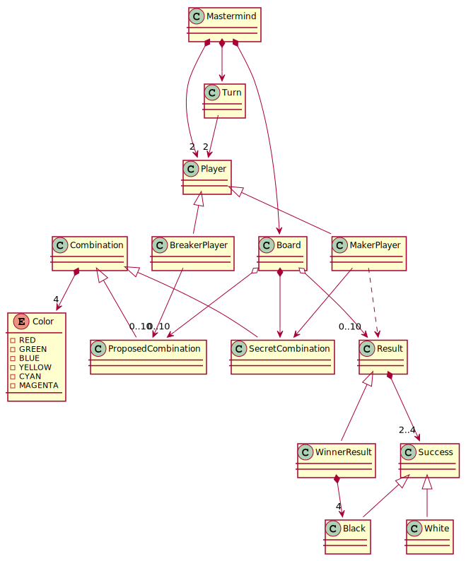
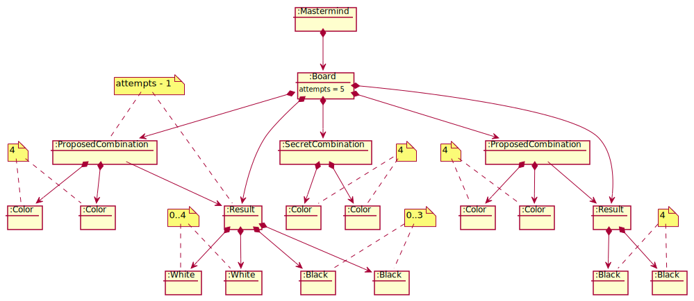
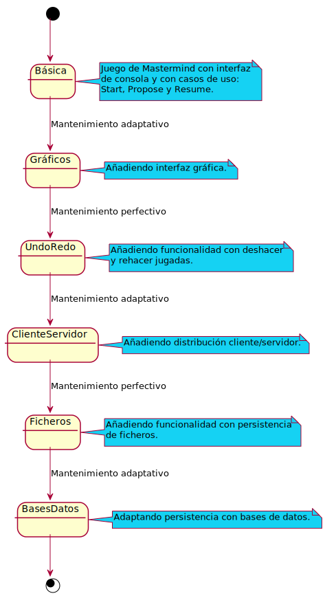

# game-mastermind
Universo Santa Tecla  
[uSantaTecla@gmail.com](mailto:uSantaTecla@gmail.com)  

## Índex

* [domainModel](#domainModel)  
   * [vocabulary](#vocabulary) 
   * [initialState](#initialState) 
   * [finalState](#finalState)  
   * [instructions](#instructions)
 * [versions](#versions)
    * [0.0.dataLanguage](./0.0.dataLanguages/README.md)
    * [0.0.publicationLanguage](./0.0.publicationLanguage/README.md)  
    * [1.0.basic](./1.0.basic/README.md)
    * [1.1.machine](./1.1.machine/README.md)
    * [2.0.graphics](./2.0.graphics/README.md)
    * [3.0.undoRedo](./3.0.undoRedo/README.md)
    * [4.0.distributed](./4.0.distributed/README.md)
    * [5.0.files](./5.0.files/README.md)
    * [6.0.bbdd](./6.0.bbdd/README.md)

## domainModel  
  
  

[WIKI](https://es.wikipedia.org/wiki/Mastermind)

[Youtube](https://www.youtube.com/watch?v=2-hTeg2M6GQ)
  
### vocabulary

  
  
### initialState 
### finalState  
  
  

### instructions 
  
## versions   
  
  
